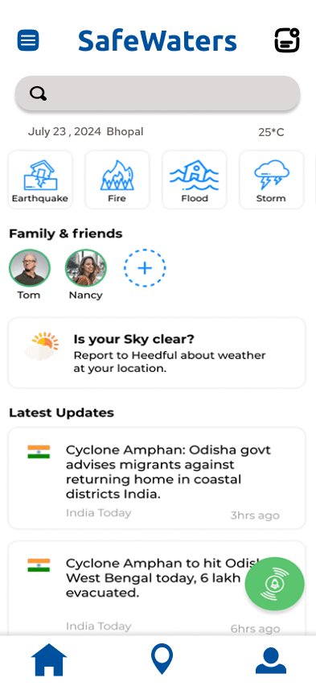
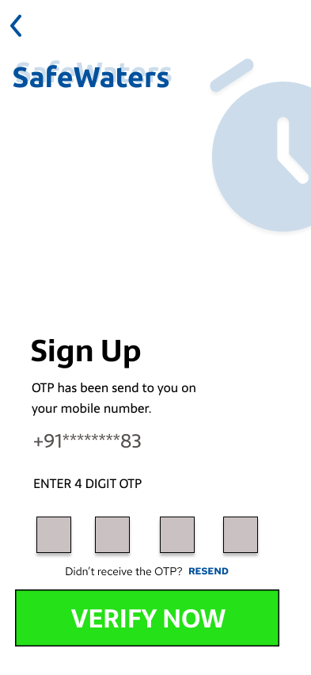

# User Interface

## Overview
This repository contains the user interface (UI) for our disaster recovery solution. The UI is designed as a mobile application using Figma. It provides users with access to disaster-related information, sign-up functionality, and verification processes. Additionally, it includes a splash screen to showcase updates and highlight different types of disasters.

## Table of Contents
1. **Introduction**
2. **Features**
3. **Getting Started**
4. **Screens**
5. **Contributing**

## Introduction
Our disaster recovery solution aims to assist users during emergencies by providing relevant information, facilitating communication, and enabling quick responses. The mobile app UI serves as the front end for this solution.

## Features
- **Home Page:**
  - Overview of the app's purpose and features.
  - Quick access to critical information (e.g., emergency contacts, safety tips).
  - Latest updates on disasters and recovery efforts.

- **Sign-Up Page:**
  - User registration process.
  - Collects essential details (name, email, password).

- **Verification Page:**
  - Validates user identity (e.g., email verification, phone number verification).
  - Ensures secure access to the app.

- **Splash Screen:**
  - Displays when the app launches.
  - Showcases recent updates, alerts, and highlights different disaster types.
  - Creates a visually engaging entry point for users.

## Screens
### Home Page

### Sign-Up Page

### Verification Page

### Splash Screen

## Contributing
We welcome contributions! If you'd like to improve the UI, fix bugs, or add features, please follow our contribution guidelines.

Feel free to adapt this README to your specific project requirements. Remember to include any additional setup instructions, deployment details, and relevant documentation. If you have any more questions or need further assistance, feel free to ask! 😊🚀

And hey, designing a disaster recovery solution is like building a digital safety net for the world—pretty cool, right? 🌍🔗

